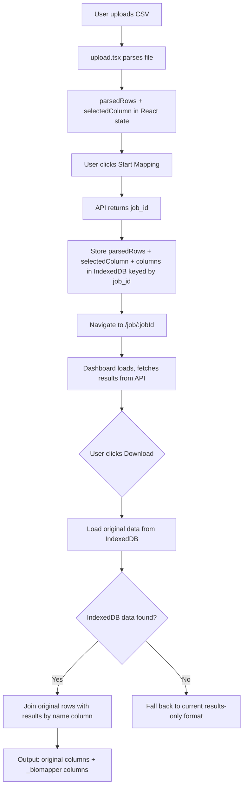

# feat: Preserve All Original Columns in Output Downloads

## Overview

Output downloads currently contain only biomapper-generated data. Users lose their original columns (feature_id, sample labels, metadata) and must manually reconcile. This plan adds IndexedDB-based persistence of the original parsed rows so downloads produce the user's data enriched with biomapper results, not replaced by them.

## Problem Frame

When a user uploads a CSV with columns like `feature_id`, `compound_name`, `match_level`, `issue_category`, `provided_ids`, the pipeline extracts only the name column and hint values. The downloadable TSV/CSV contains only biomapper results keyed by deduplicated entity names. Users expect to get their full dataset back with enrichment columns appended. (see origin: `docs/brainstorms/preserve-original-columns-in-output-requirements.md`)

## Requirements Trace

- R1. All original rows and columns preserved in TSV/CSV output; JSON adds `originalRows` alongside existing structure
- R2. All biomapper-generated columns suffixed with `_biomapper` (always when original data is present in IndexedDB; falls back to current naming if original data is missing)
- R3. Original data stored client-side via IndexedDB, keyed by job ID
- R4. Column ordering: original columns first, then biomapper core, identifiers, equivalent IDs
- SC1. All original columns present and unchanged in download
- SC2. All biomapper columns have `_biomapper` suffix
- SC3. Row count matches original file (duplicates preserved)
- SC4. Byte-for-byte fidelity of original values
- SC5. Works for files up to 10,000 rows
- SC6. Dashboard table view unchanged

## Scope Boundaries

- Downloads only — dashboard table view is not changed
- No API request/response changes — original data stays client-side
- No server-side storage of original rows
- `handleDownloadMarkdown` is unchanged — it produces a summary report, not row-level data

## Context & Research

### Relevant Code and Patterns

- `artifacts/frontend/src/pages/upload.tsx` — `parsedRows` state (line 134), `processRows` callback (line 262), `selectedColumn` state (line 133), `handleSubmit` (line 366), `setLocation` navigation (line 386)
- `artifacts/frontend/src/pages/dashboard.tsx` — `handleDownloadTSV` (lines 217-290), `handleDownloadCSV` (lines 292-367), `handleDownloadJSON` (lines 205-215)
- `artifacts/frontend/src/App.tsx` — wouter `<Switch>` routing; upload page is unmounted on navigation to dashboard
- `artifacts/frontend/src/contexts/env-context.tsx` — only existing cross-page persistence pattern (localStorage for env toggle)
- No IndexedDB, idb-keyval, or global state management exists in the project

### Institutional Learnings

- OpenAPI spec is manually maintained; codegen pipeline documented in `docs/solutions/logic-errors/biomapper-sdk-dict-list-data-loss-2026-05-06.md`
- No frontend test infrastructure exists

## Key Technical Decisions

- **IndexedDB via `idb-keyval`**: Lightweight (~600B gzipped), simple get/set/del API, no schema setup. Stores `{ parsedRows, selectedColumn, columns }` keyed by job ID. No practical size limit unlike sessionStorage (5MB) or localStorage (5MB).
- **Join happens at download time, not at render time**: The dashboard table remains unchanged (SC6). Original rows are loaded from IndexedDB only when the user clicks a download button. This avoids re-rendering the table with potentially thousands of rows.
- **`_biomapper` suffix is unconditional when original data is present**: Replaces the prior conditional behavior. When IndexedDB data is missing (direct URL navigation), downloads fall back to current column naming for backward compatibility.
- **No "Original Name" column in output**: The name column from the original file IS one of the original columns. The biomapper result is joined onto it. The old "Original Name" header was a biomapper construct; now the user's actual column name appears.

## Open Questions

### Resolved During Planning

- **Where to store selectedColumn?** In IndexedDB alongside parsedRows, in the same object keyed by job ID. The dashboard needs it to perform the join.
- **How to handle the join when original row has untrimmed name?** Use `String(row[selectedColumn]).trim()` for lookup against `result.name`, same normalization as the dedup step. The original value is preserved in the output row.
- **What about the existing `providedIds` echo?** It's subsumed. The original provided_ids column now appears directly from the original rows. The `providedIds` field from the API is still useful for the dashboard table display but is not needed in downloads when original data is present.

### Deferred to Implementation

- Exact IndexedDB cleanup strategy beyond the mandatory "delete previous job before saving new one" (e.g., TTL-based cleanup of orphaned entries)
- Whether to pass `selectedColumn` via URL param as well (belt-and-suspenders; implementer can decide)

## High-Level Technical Design

> *This illustrates the intended approach and is directional guidance for review, not implementation specification. The implementing agent should treat it as context, not code to reproduce.*

## Implementation Units

- [ ] **Unit 1: Add idb-keyval dependency + storage utility**

**Goal:** Add IndexedDB persistence capability to the frontend.

**Requirements:** R3

**Dependencies:** None

**Files:**
- Modify: `artifacts/frontend/package.json`
- Create: `artifacts/frontend/src/lib/original-data-store.ts`

**Approach:**
- Add `idb-keyval` as a runtime dependency (in `dependencies`, not `devDependencies`) in the frontend package
- Create a thin wrapper module that exports `saveOriginalData(jobId, data)`, `loadOriginalData(jobId)`, and `deleteOriginalData(jobId)`. The stored shape is `{ parsedRows: Record<string, string>[], selectedColumn: string, columns: string[] }`
- Keep the wrapper simple — idb-keyval's get/set/del are already minimal

**Patterns to follow:**
- `artifacts/frontend/src/contexts/env-context.tsx` for the pattern of a thin persistence wrapper

**Test expectation:** none — thin wrapper over idb-keyval, verified by integration in Unit 2

**Verification:**
- `idb-keyval` is in package.json and installs cleanly
- The utility module exports the three functions with correct TypeScript types

---

- [ ] **Unit 2: Store original data on job creation (upload.tsx)**

**Goal:** Persist parsed rows to IndexedDB when the mapping job starts.

**Requirements:** R3

**Dependencies:** Unit 1

**Files:**
- Modify: `artifacts/frontend/src/pages/upload.tsx`

**Approach:**
- In `handleSubmit`, after `startMapping.mutate` succeeds and before `setLocation`, call `saveOriginalData(data.job_id, { parsedRows, selectedColumn, columns })`
- Await the IndexedDB write before calling `setLocation` — `idb-keyval`'s `set()` resolves in <5ms even for large payloads, so the user won't notice the delay, and it eliminates the race condition where the dashboard reads before the write commits
- Before saving, delete the previous job's IndexedDB entry to prevent unbounded storage growth (store a "last job ID" and delete the previous one)

**Patterns to follow:**
- Existing `onSuccess` callback in `startMapping.mutate` (upload.tsx line 384)

**Test scenarios:**
- Happy path: After job creation, IndexedDB contains parsedRows, selectedColumn, and columns for the job ID
- Edge case: Very large file (10K rows, 20 columns) — IndexedDB stores it without error
- Edge case: User starts a new job — previous job's data is cleaned up

**Verification:**
- Navigating to the dashboard after upload, IndexedDB entry exists for the job ID
- Data shape matches what was parsed

---

- [ ] **Unit 3: Join original rows with results in download handlers (dashboard.tsx)**

**Goal:** TSV and CSV downloads produce all original rows with all original columns, plus biomapper results with `_biomapper` suffix.

**Requirements:** R1, R2, R4, SC1-SC5

**Dependencies:** Unit 1, Unit 2

**Files:**
- Modify: `artifacts/frontend/src/pages/dashboard.tsx`

**Approach:**
- At download time (not render time), call `loadOriginalData(jobId)` to get `{ parsedRows, selectedColumn, columns }`
- If data is found:
  - Build a lookup map: `Map<string, MappingResult>` keyed by `result.name` (trimmed). This assumes the API returns at most one result per unique name (current behavior); if that invariant changes, the map would need to handle duplicates
  - For each original row, look up the result by `String(row[selectedColumn]).trim()`
  - Output columns in order: all original columns (using `columns` array for ordering), then biomapper core columns (`resolved_biomapper`, `primary_curie_biomapper`, `confidence_tier_biomapper`, `confidence_score_biomapper`, `needs_review_biomapper`), then identifier columns (`hmdb_biomapper`, etc.), then equiv columns (`equiv_HMDB_biomapper`, etc.)
  - For rows with no matching result (name not found in results), biomapper columns are empty
  - Column name collision detection: if any original column name matches a biomapper column name, append `_2` to the biomapper column
- If data is NOT found (direct navigation, expired):
  - Fall back to current download format (results-only rows with current column naming, preserving the existing `hasProvidedIds` conditional suffix logic)
- The existing `hasProvidedIds`-based suffix logic is replaced entirely when IndexedDB data is present: all biomapper columns get `_biomapper` unconditionally. When IndexedDB data is absent, the existing conditional logic is preserved for backward compatibility
- Apply the same logic to both `handleDownloadTSV` and `handleDownloadCSV`
- The download handlers become async (IndexedDB is async) — use `async/await` and handle the slight delay

**Patterns to follow:**
- Existing `handleDownloadTSV` column construction and row iteration pattern
- Existing `equivCols` collection pattern for dynamic columns

**Test scenarios:**
- Happy path: 5-column CSV with 10 rows (3 unique names) → download has 10 rows, 5 original columns + N biomapper columns
- Happy path: All biomapper columns have `_biomapper` suffix
- Happy path: Original column values are byte-for-byte identical
- Edge case: Row with name not found in results → biomapper columns are empty strings
- Edge case: Original file has a column named `hmdb_biomapper` → biomapper column becomes `hmdb_biomapper_2`
- Edge case: IndexedDB data missing → falls back to current results-only format
- Edge case: Duplicate rows with same name → both get identical biomapper result columns

**Verification:**
- Downloaded TSV has same row count as original file
- Original column headers are preserved exactly as in the input file (no renaming)
- Biomapper columns all have `_biomapper` suffix
- Rows without results have empty biomapper columns
- Fallback works when IndexedDB is empty (current results-only format with current column naming)

---

- [ ] **Unit 4: Update JSON download to include originalRows**

**Goal:** JSON download adds `originalRows` alongside existing `summary` and `results`.

**Requirements:** R1 (JSON part)

**Dependencies:** Unit 1, Unit 2

**Files:**
- Modify: `artifacts/frontend/src/pages/dashboard.tsx`

**Approach:**
- In `handleDownloadJSON`, load original data from IndexedDB
- If found, add `originalRows` key to the JSON output: `{ summary, results, originalRows: parsedRows }`
- If not found, output current format: `{ summary, results }`
- `originalRows` is the raw parsedRows array — no joining needed for JSON since consumers can join themselves
- Make the handler async (same pattern as Unit 3)

**Patterns to follow:**
- Existing `handleDownloadJSON` structure

**Test scenarios:**
- Happy path: JSON includes `originalRows` array with all original rows
- Edge case: IndexedDB data missing → JSON has `summary` and `results` only (no `originalRows` key)

**Verification:**
- JSON download includes `originalRows` when original data is available
- JSON structure is backward-compatible (summary + results still present)

---

- [ ] **Unit 5: End-to-end verification**

**Goal:** Verify the full flow with the test dataset.

**Requirements:** SC1-SC6

**Dependencies:** Units 1-4

**Files:**
- Reference: `biomapper_ui_test_dataset.csv`

**Approach:**
- Upload the test dataset (5 columns: feature_id, compound_name, match_level, issue_category, provided_ids)
- Run a mapping job
- Download TSV and verify: all 5 original columns present, all biomapper columns have `_biomapper` suffix, row count matches original
- Download CSV and verify same
- Download JSON and verify `originalRows` is present
- Verify dashboard table is unchanged

**Test expectation:** none — manual integration verification

**Verification:**
- TSV/CSV has all original columns + `_biomapper` suffixed enrichment columns
- Row count matches original file
- Dashboard table view is unchanged
- JSON has `originalRows` alongside `summary` and `results`

## System-Wide Impact

- **Interaction graph:** Upload page → IndexedDB → Dashboard download handlers. No middleware or callbacks affected
- **Error propagation:** IndexedDB failures are handled gracefully — downloads fall back to current format
- **State lifecycle risks:** IndexedDB entries persist until explicitly deleted. Cleanup on new job creation prevents unbounded growth
- **Unchanged invariants:** API request/response unchanged. Dashboard table unchanged. Job store unchanged. Backend mapper unchanged

## Risks & Dependencies

| Risk | Mitigation |
|------|------------|
| idb-keyval adds a new dependency | ~600B gzipped, zero-config, widely used. Minimal risk |
| IndexedDB not available in private browsing | Most modern browsers support IndexedDB in private mode. If unavailable, fallback produces current format |
| Download handlers become async | Minimal UX impact — IndexedDB read is <10ms for 10K rows. No loading spinner needed |
| Large file serialization to IndexedDB | IndexedDB handles structured clones natively — no JSON.stringify overhead. 10K rows × 20 columns is well within limits |

## Sources & References

- **Origin document:** [preserve-original-columns-in-output-requirements.md](docs/brainstorms/preserve-original-columns-in-output-requirements.md)
- **Prior work:** [provided-ids-hint-column-fix-requirements.md](docs/brainstorms/provided-ids-hint-column-fix-requirements.md) — R2 suffix behavior superseded
- Related code: `artifacts/frontend/src/pages/upload.tsx`, `artifacts/frontend/src/pages/dashboard.tsx`
